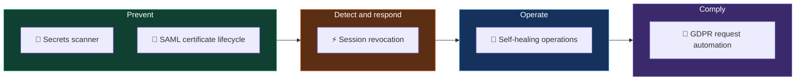

# Identity security automation

Five pieces of automation I designed and built across enterprise identity programmes, rebuilt here as runnable, public versions.

**No client code or data is in this repository.** Every dataset is synthetic, generated by [`tools/generate_datasets.py`](tools/generate_datasets.py) and shaped to the real scale of each programme. The results quoted are from the production versions.

## How the five fit together



## The projects

| | Project | Problem it solves | Production result |
|---|---|---|---|
| 📜 | [**SAML certificate lifecycle**](saml-cert-lifecycle/) | Expired SSO certificates taking apps down | Priority SSO outages **−92%** |
| 🔑 | [**Secrets scanner**](secrets-scanner/) | Credentials committed to Git | **77** secrets caught in **37** repos before production |
| 🤖 | [**Self-healing operations**](self-healing-ops/) | Engineers stuck on repetitive identity tickets | **−67%** effort, about **60 h/month** |
| 📨 | [**GDPR request automation**](gdpr-dsr-automation/) | Thousands of data requests with a one-month legal deadline | **4,000–6,000** requests/month, **2–3 h/day** freed |
| ⚡ | [**Session revocation**](session-revocation/) | Attackers staying logged in after a password reset | Sessions revoked in **under 2 s** |

Each folder has the problem, the flow, the design decisions, a synthetic dataset, runnable code and charts it draws itself.

## Run everything

Python 3.10+ and nothing else (the scanner tests need `pytest`).

```bash
python tools/generate_datasets.py      # rebuild all synthetic data
python saml-cert-lifecycle/lifecycle.py
python secrets-scanner/scanner.py --report
python self-healing-ops/triage.py
python gdpr-dsr-automation/processor.py
python session-revocation/respond.py
python -m pytest secrets-scanner/tests
```

CI runs all of this on every push, and the secrets scanner scans this repository too.

## About me

Identity security architect at Accenture · [LinkedIn](https://www.linkedin.com/in/samikshya-dash-cybersecurity) · smkshy@hotmail.com
