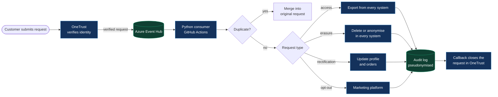
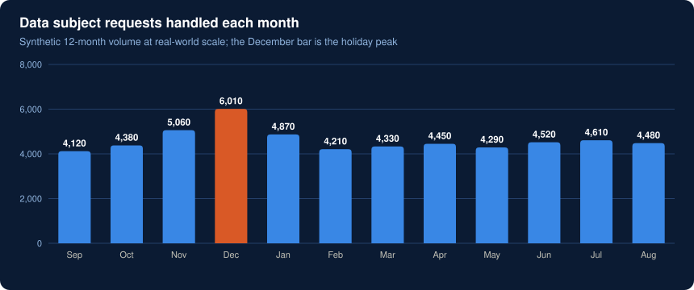
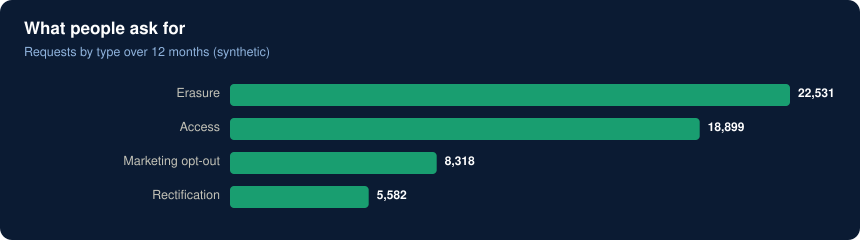

# GDPR data subject request automation

> **Result in production:** **4,000–5,000** requests a month handled automatically (**6,000** at holiday peak) for a 100M+ user platform, freeing **2–3 hours of manual work a day**.
> Volumes and requests in this folder are synthetic.

## The problem

Under GDPR, anyone can ask what data you hold about them, ask you to correct it or ask you to delete it, and you have **one month** to answer. On a consumer platform with 100M+ accounts, that means thousands of requests a month, each touching several systems: the identity store, orders, marketing, support and logs.

Done by hand, it meant copying IDs between tools, a growing backlog before every holiday season and no reliable evidence of what was deleted where.

## How it works



### Design choices

- **Event Hub between OneTrust and the code.** Holiday peaks arrive in bursts. The hub absorbs them, and nothing is lost if the consumer is down for a while.
- **Idempotent processing.** Every step can run twice without harm, so retries are safe. Duplicate submissions are merged, not processed twice.
- **Identity is verified before anything happens.** An unverified erasure request could be an attacker deleting someone else's account.
- **Erasure means anonymise where the law requires records.** Order records are kept for tax purposes but stripped of personal data. Logs are masked, not deleted.
- **The audit log never stores the email address.** It stores a hash, so the evidence of deletion doesn't itself hold personal data.
- **Where it runs:** it started on AWS Lambda and now runs on GitHub Actions.

## Try it

```bash
python gdpr-dsr-automation/processor.py
```

It processes 250 synthetic requests from [`data/dsr_requests_sample.json`](data/dsr_requests_sample.json): fulfilled, merged as duplicates or put on hold when identity isn't verified. It writes `audit_log.json` and redraws the charts.





**Built with:** OneTrust · Azure Event Hub · Python · AWS Lambda → GitHub Actions · Azure AD B2C (Graph API)
