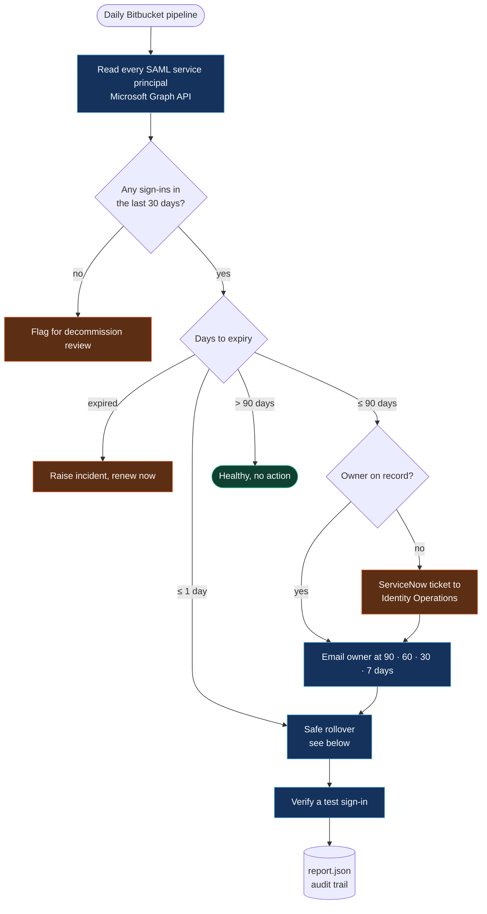
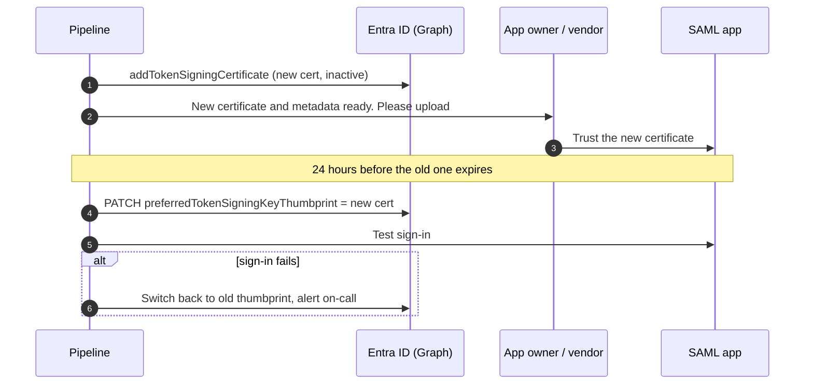
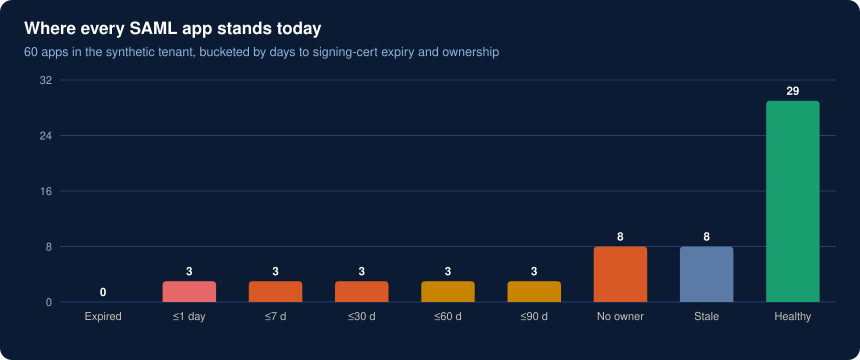

# SAML certificate lifecycle automation

> **Result in production:** priority SSO outages down **92%**, and **100%** of stale apps found and flagged.
> Everything in this folder runs on a synthetic tenant, so you can try it without access to any real directory.

## The problem

Every SAML app in Microsoft Entra ID signs its tokens with a certificate that expires, usually after three years. Nobody owns the calendar for hundreds of them. When one lapses, users can't sign in to that app, and the fix happens during an outage instead of before one.

Three things made it worse:

1. **Ownership drift.** App owners change teams, and the reminder email goes to nobody.
2. **Not every app reads federation metadata.** Many service providers need the new certificate uploaded by hand, so renewing on the identity side alone can break sign-in.
3. **Dead apps look like live ones.** Apps with zero sign-ins still consume renewal effort and stay in the attack surface.

## How it works



### Why the reminders start at 90 days

Apps that read the federation metadata URL pick up a new certificate by themselves. Apps that don't need the vendor or app team to upload it, and that can take weeks. The 90-day warning gives those teams time. The 7-day warning is the escalation.

### Safe rollover (the step that prevents the outage)

Renewing is not just "make a new certificate". Doing that and switching immediately breaks any app that hasn't trusted the new one yet. The sequence is:



## Try it

```bash
python saml-cert-lifecycle/lifecycle.py
```

It reads [`data/enterprise_apps.json`](data/enterprise_apps.json), prints the action for every app that needs one, writes `report.json` with ready-to-send ServiceNow ticket payloads, and redraws the chart below.



### The synthetic dataset

60 invented apps with the same fields Graph returns, plus two I add for decisions:

| Field | Example | Used for |
|---|---|---|
| `displayName` | `Payroll` | Messages and tickets |
| `owner` | `owner07@contoso.example` or `null` | Who to notify, or open a ticket |
| `criticality` | `P1` | Ticket urgency |
| `certExpiry` | `2026-09-07` | Which bucket the app falls in |
| `metadataUrlConsumed` | `true` | Whether rollover needs a human upload |
| `signInsLast30d` | `0` | Stale app detection |

Regenerate it with `python tools/generate_datasets.py`.

## Running it for real

[`bitbucket-pipelines.yml`](bitbucket-pipelines.yml) runs `lifecycle.py --live --apply` on a daily schedule. The app registration needs `Application.ReadWrite.All`; `TENANT_ID`, `CLIENT_ID` and `CLIENT_SECRET` live in secured pipeline variables, never in the repo. A certificate credential is better than a client secret for this app.

**Built with:** Python · Microsoft Graph API · Bitbucket Pipelines · ServiceNow
