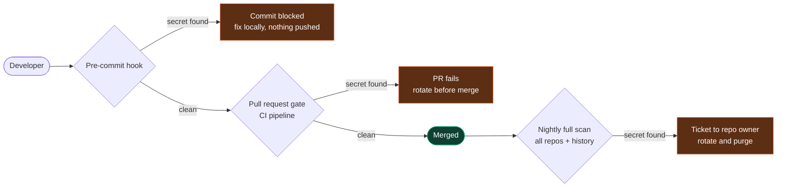
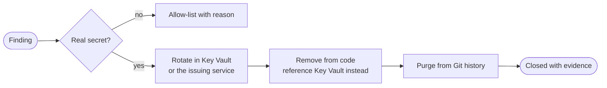
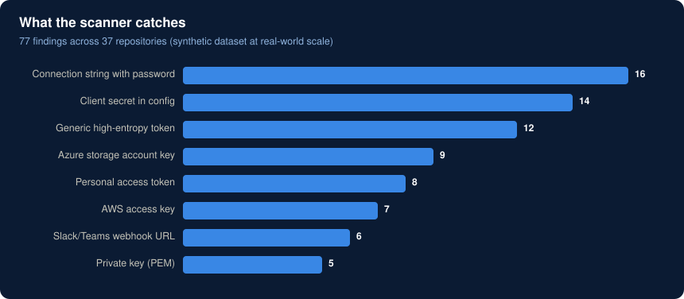
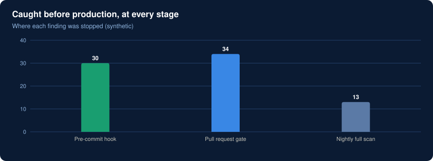

# Secrets scanner

> **Result in production:** **77 leaked secrets** caught across **37 repositories** before they reached production.
> The findings dataset here is synthetic, shaped to that same scale.

## The problem

Developers under deadline paste a connection string into `appsettings.json` or leave a client secret in a notebook "just for testing". Once that's pushed, the secret is in Git history for good, and rotating it becomes an incident.

The goal was to catch secrets **as early as possible**, while keeping false positives low enough that developers don't start ignoring the tool.

## Three layers, one rule set



The pre-commit hook is the cheapest place to stop a secret because nothing has left the laptop. The PR gate catches anyone who skipped the hook. The nightly scan catches old secrets already sitting in history.

## How detection works

[`scanner.py`](scanner.py) combines two methods:

1. **Known patterns.** Regular expressions for secret formats that are easy to recognise: AWS keys, Azure storage keys, PEM private keys, GitHub and GitLab tokens, connection strings, webhook URLs.
2. **Entropy.** Any token of 32+ characters with Shannon entropy ≥ 4.3 bits per character looks random, and random-looking strings in code are usually keys. This catches secrets with no known format.

Documented test values can be allow-listed inline with `# secrets-scanner:allow`, so the tool never becomes an obstacle for legitimate fixtures.

**Severity decides what blocks.** Critical and serious findings fail the commit or build; warnings are reported but don't block.

## What happens after a finding



**Rotate first, then remove.** Deleting a leaked secret from the code doesn't make it safe; anyone who cloned the repo still has it.

## Try it

```bash
python secrets-scanner/scanner.py --report      # charts from the synthetic findings
python secrets-scanner/scanner.py path/to/code  # scan a folder; exit code 1 blocks CI
python -m pytest secrets-scanner/tests          # unit tests
```





The test fixtures build their fake secrets at runtime, so this repository never contains anything that looks like a live credential.

**Built with:** Python · regex and Shannon entropy · pre-commit · Azure DevOps and GitHub Actions
