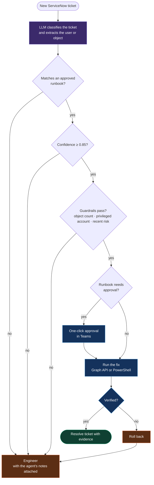
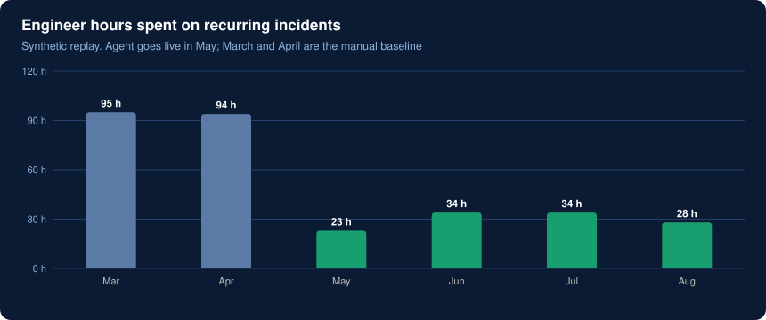
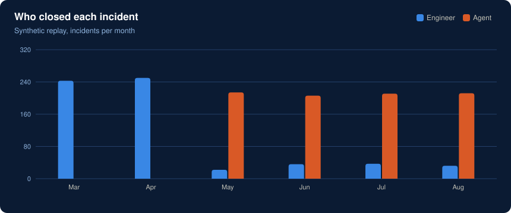

# Self-healing identity operations with agentic AI

> **Result in production:** operations effort on recurring incidents down **67%**, about **60 hours a month**.
> The incident history here is synthetic; replaying it through the same decision logic gives a similar result (about 68%).

## The problem

Most of the identity queue was the same handful of tickets: locked accounts, failed group syncs, licence errors, users who changed phones and lost MFA. Each needed an engineer for 10 to 40 minutes, and none of them needed judgement.

The risk with automating them is obvious: an agent that acts on the wrong account, or on 5,000 accounts at once, is worse than a slow queue. So the design question was not "can an agent fix this?" but **"when is it safe to let it?"**

## How it works

The workflow runs in **n8n**. An LLM classifies each ticket, but it **never chooses the fix**. It can only pick from a catalogue of approved runbooks, and code checks the guardrails before anything runs.



### The guardrails

Each runbook in [`runbooks.yaml`](runbooks.yaml) carries its own limits:

| Runbook | Max objects | Skip privileged accounts | Needs approval |
|---|---|---|---|
| Account lockout | 1 | ✅ | — |
| Group sync failure | 500 | ✅ | — |
| Licence assignment error | 50 | — | — |
| MFA re-registration | 1 | ✅ | ✅ manager |
| Stale device object | 200 | — | — |
| Service account password expiry | 1 | — | ✅ |

MFA resets and service-account rotations always need a human click. They're exactly what an attacker would try to trigger through a fake ticket.

## Try it

```bash
python self-healing-ops/triage.py
```

It replays six months of synthetic tickets from [`data/incidents.csv`](data/incidents.csv): two months of manual baseline, then four with the agent live.





Novel issues and unexplained Conditional Access blocks still go to engineers, by design. The agent's job is the repetitive tickets, so engineers have time for those.

**Built with:** n8n · LLM classification · Microsoft Graph API · PowerShell · ServiceNow · Microsoft Teams approvals
