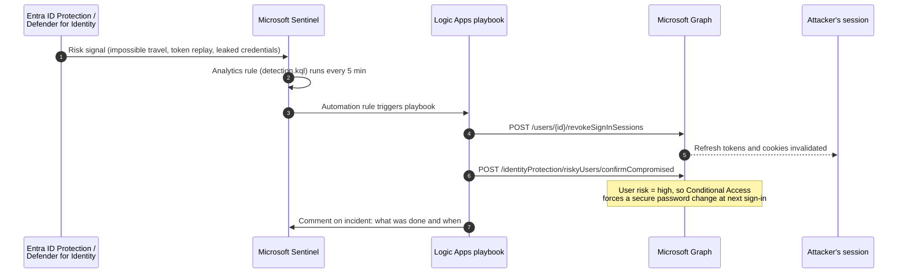
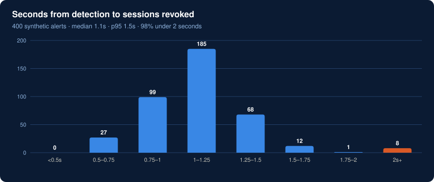

# Compromised session response in under 2 seconds

> **Result in production:** sessions on a compromised account revoked in **under 2 seconds** from detection, with no analyst in the loop.
> The alerts and timings in this folder are synthetic.

## The problem

Resetting a stolen password doesn't log the attacker out. Their refresh token and session cookies keep working until they expire, which can be hours. Most of the damage in token theft and MFA-fatigue attacks happens in that gap, while the alert sits in a queue waiting for an analyst.

## How it works



### What triggers it

[`detection.kql`](detection.kql) fires only on high-confidence signals:

- Impossible travel, anomalous token or leaked credentials from Entra ID Protection and Defender for Identity
- **MFA fatigue:** 5 or more denied push requests in 10 minutes
- **Break-glass accounts are excluded** through a Sentinel watchlist, so the automation can never lock out emergency access

### Why revoke automatically instead of waiting for an analyst

A wrongly revoked session costs the user one sign-in. A stolen session left alive for an hour costs much more. With only high-confidence signals feeding it, automatic revocation is the safer default. The analyst still reviews the incident, but after the attacker is out.

## Try it

```bash
python session-revocation/respond.py
```

It reports detection-to-revocation time across 400 synthetic alerts in [`data/risk_alerts_sample.csv`](data/risk_alerts_sample.csv), broken into trigger, playbook and Graph time.



The few alerts over 2 seconds are throttled Graph calls. The playbook retries with backoff rather than failing.

**Built with:** Microsoft Sentinel (KQL) · Azure Logic Apps · Microsoft Graph · Entra ID Protection · Defender for Identity
